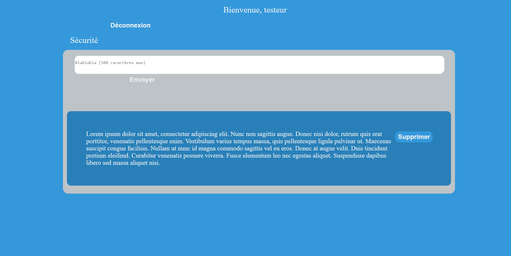
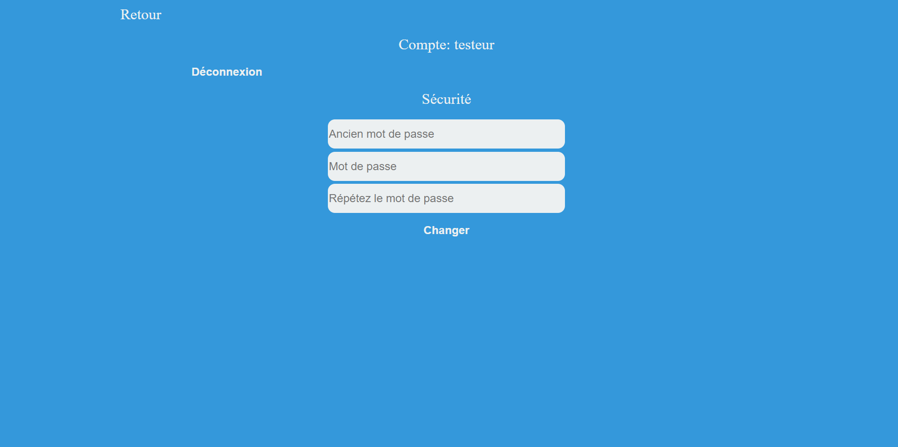

# Panneau d'affichage numérique, webapp





SQL code:
```SQL

CREATE TABLE `comptes` (
  `id` int(30) UNSIGNED NOT NULL,
  `token` varchar(2048) DEFAULT NULL,
  `username` varchar(30) DEFAULT NULL,
  `password` varchar(300) NOT NULL,
) ENGINE=InnoDB DEFAULT CHARSET=utf8mb4;

ALTER TABLE `comptes`
  ADD PRIMARY KEY (`id`);

ALTER TABLE `comptes`
  MODIFY `id` int(30) UNSIGNED NOT NULL AUTO_INCREMENT;
COMMIT;


CREATE TABLE `labels` (
  `id` int(255) NOT NULL,
  `label` text NOT NULL,
  `user_id` int(30) NOT NULL
) ENGINE=InnoDB DEFAULT CHARSET=utf8mb4;


ALTER TABLE `labels`
  ADD PRIMARY KEY (`id`);


ALTER TABLE `labels`
  MODIFY `id` int(255) NOT NULL AUTO_INCREMENT;
COMMIT;

```
