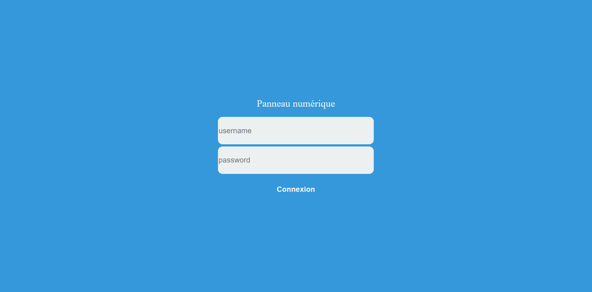

# Panneau d'affichage numérique, WebApp




More Screenshots: [ demo.md ](./demo.md)

## Requirements / installation

- need [ PHPMailer 6.2.0 ](https://github.com/PHPMailer/PHPMailer/releases/tag/v6.2.0)
  - Add the `PHPMailer/src` files on `PHPMailer/` Folder on the root of this project

- Configure the `var_config.php` file

SQL code:
```SQL

CREATE TABLE `comptes` (
  `id` int(30) UNSIGNED NOT NULL,
  `token` varchar(1024) DEFAULT NULL,
  `username` varchar(30) DEFAULT NULL,
  `password` varchar(300) NOT NULL,
  'email' varchar(200) NOT NULL
) ENGINE=InnoDB DEFAULT CHARSET=utf8mb4;

ALTER TABLE `comptes`
  ADD PRIMARY KEY (`id`);

ALTER TABLE `comptes`
  MODIFY `id` int(30) UNSIGNED NOT NULL AUTO_INCREMENT;
COMMIT;


CREATE TABLE `labels` (
  `id` int(255) UNSIGNED NOT NULL,
  `label` text NOT NULL,
  `user_id` int(30) NOT NULL
) ENGINE=InnoDB DEFAULT CHARSET=utf8mb4;


ALTER TABLE `labels`
  ADD PRIMARY KEY (`id`);


ALTER TABLE `labels`
  MODIFY `id` int(255) NOT NULL AUTO_INCREMENT;
COMMIT;

```
